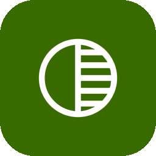

<p align="center">
  
</p>

<h1 align="center">portal.</h1>

<p align="center">
  A desktop-first VRChat group monitor. Portal watches your selected groups and<br/>
  automatically invites you when a new instance opens — without hammering the VRChat API.
</p>

> **Disclaimer** — Portal uses VRChat's unofficial, community-documented API.
> VRChat's ToS (§13.2(j)) broadly prohibits automated API access, while their
> Creator Guidelines simultaneously acknowledge third-party tools and provide
> rules for building them responsibly. This contradiction puts tools like Portal
> in a grey zone. Portal does its best to be a good API citizen — it uses
> randomised polling intervals (never fixed-clock), exponential back-off,
> proper `User-Agent` identification, and caching — but **use it at your own
> risk**. VRChat may take action against accounts that use third-party
> automation tools.

<p align="center">
  <!-- GIF cycling between the login page and dashboard -->
  
</p>

## Features

- **Group instance monitoring** — polls your selected groups at regular intervals and detects when a new instance opens
- **Auto-invite** — automatically sends a self-invite the moment a new instance is detected for a monitored group
- **Boost mode** — temporarily switches a single group to high-frequency polling (~every 10 seconds, up to 15 minutes) when you need faster detection
- **Relay assist** — when boost mode is active, a Cloudflare Durable Objects WebSocket relay forwards new-instance hints from the detecting client to all other Portal clients watching the same boosted group, so they can act immediately without waiting for their next poll — [learn more](workers/relay_assist/README.md)
- **Group calendar** — shows today's scheduled events for your monitored groups
- **Material 3 Expressive UI** — native desktop window chrome, spring-physics animations, adaptive light/dark themes

## Platforms

| Platform | Status      |
| -------- | ----------- |
| macOS    | ✓ Supported |
| Windows  | ✓ Supported |

## Getting started

### Prerequisites

- Flutter 3.41+ / Dart 3.11+
- A VRChat account

### Run

```bash
flutter run -d macos
# or
flutter run -d windows
```

### Run against a custom relay (dev / staging)

```bash
flutter run -d macos \
  --dart-define=PORTAL_RELAY_BOOTSTRAP_URL=https://<your-worker>/relay/bootstrap
```

To allow a non-TLS local relay during development only:

```bash
flutter run -d macos \
  --dart-define=PORTAL_RELAY_BOOTSTRAP_URL=http://127.0.0.1:8787/relay/bootstrap \
  --dart-define=PORTAL_ALLOW_INSECURE_RELAY_TRANSPORT=true
```

### Test

```bash
flutter test
```

### Analyze & format

```bash
flutter analyze
dart format .
```

## Architecture

```
lib/
├── main.dart           # App bootstrap, window setup, go_router definition
├── pages/              # LoginPage, DashboardPage
├── widgets/            # Feature-grouped UI components
│   ├── common/
│   ├── dashboard/
│   ├── events/
│   ├── group_instances/
│   ├── group_selection/
│   ├── inputs/
│   ├── login/
│   ├── user/
│   ├── vrchat/
│   └── window/
├── providers/          # Riverpod state (auth, group monitor, calendar, theme, pipeline)
├── services/           # VRChat API wrappers, relay networking
├── models/             # Plain domain types
├── theme/              # Material 3 tokens, AppTheme, ThemeExtensions
├── constants/          # AppConstants, storage keys, UI constants
└── utils/              # Logger, caching, datetime, error helpers
```

All app state flows through Riverpod providers. The core monitoring loop lives in `GroupMonitorNotifier`, split across `_fetch`, `_loops`, `_persistence`, and `_relay` part files.

## Relay assist

Portal ships with a built-in production relay. To deploy your own Cloudflare Worker:

```bash
cd workers/relay_assist
wrangler deploy
```

See [`workers/relay_assist/README.md`](workers/relay_assist/README.md) for environment variable configuration.

## Compile-time configuration

| Define                          | Default          | Purpose                            |
| ------------------------------- | ---------------- | ---------------------------------- |
| `PORTAL_RELAY_ASSIST_ENABLED`   | `true`           | Enable/disable relay entirely      |
| `PORTAL_RELAY_BOOTSTRAP_URL`    | production URL   | Override relay bootstrap endpoint  |
| `PORTAL_RELAY_APP_SECRET`       | `''`             | Shared secret for relay auth       |
| `PORTAL_ALLOW_INSECURE_RELAY_TRANSPORT` | `false` | Dev-only escape hatch for non-TLS local relay testing |

Pass any of these via `--dart-define=KEY=VALUE` at build or run time.

## License

[GPL-3.0](LICENSE)
